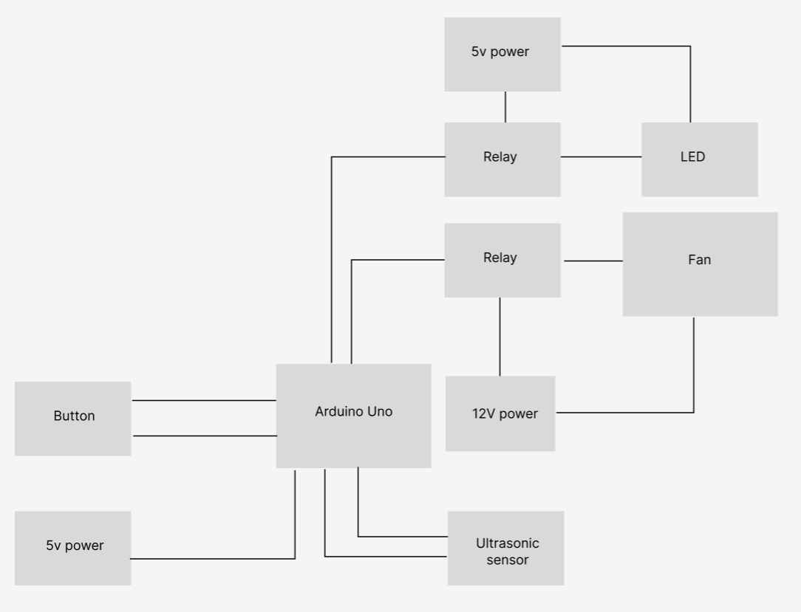

# ubs-ballgame
UBS event game with DMC

 * This sketch controls:
 * 1. Relay 1 that activates for 5 seconds when ultrasonic sensor detects object
 * 2. Relay 2 that activates for a set duration when button is pressed
 * ============================================================================
 */

// ============================================================================
// WIRING CONFIGURATION
// ============================================================================
/*
 * SHARED 5V POWER SUPPLY CONFIGURATION:
 * 
 * Power Supply Connections:
 *   - 5V+ → Sensor VCC, Relay Modules VCC
 *   - GND → Sensor GND, Relay Modules GND, Arduino GND

